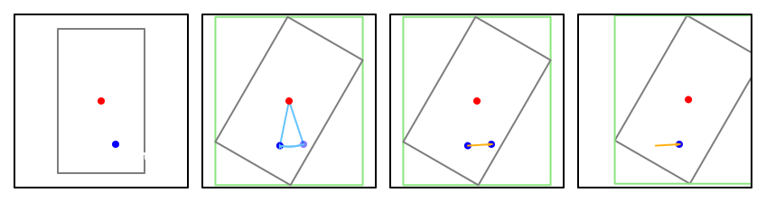

## Rectangle AABB from Transform

Calculating the axis-aligned bounding box of a rectangle that has been rotated, scaled, and translated

-----

Every drawable is a 1 x 1 unit square that is rotated by its direction, scaled by its skin size and scale, and offset by its rotation center and position. The square representation is made up of 4 points that are transformed by the drawable properties. Often we want a shape that simplifies those 4 corner points into a non-rotated shape, an axis-aligned bounding box.

One approach is to compare the x and y components of each transformed corner and find the minimum and maximum x component and the minimum and maximum y component.

We can start from this approach and determine an alternative one that produces the same output with less work.

To start with, we'll scale and rotate the unit square around its midpoint, as opposed to the skin's rotation center. This allows for some useful simplifications down the line.

First we scale, to obtain the edges/corners' positions relative to the rectangle's midpoint:
```js
const origRight = nativeSizeX * 0.5 * scaleX;
const origTop = nativeSizeY * 0.5 * scaleY;
const origLeft = -nativeSizeX * 0.5 * scaleX;
const origBottom = -nativeSizeY * 0.5 * scaleY;
```

Then we rotate.

Given the sine and cosine of an angle, the formula for rotating a point `(x, y)` is `(x * cosine - y * sine, x * sine + y * cosine)`.

We can calculate the rotated x and y values once each, moving the signs into the precalculated versions, then use those to create the rotated corners:

```js
const leftCos = origLeft * cos;
const rightCos = origRight * cos;

const leftSin = origLeft * sin;
const rightSin = origRight * sin;

const topCos = origTop * cos;
const bottomCos = origBottom * cos;

const topSin = -origTop * sin;
const bottomSin = -origBottom * sin;

const topLeft = [leftCos + topSin, leftSin + topCos];
const topRight = [rightCos + topSin, rightSin + topCos];
const bottomLeft = [leftCos + topSin, leftSin + topCos];
const bottomRight = [rightCos + topSin, rightSin + topCos];
```

Then we can calculate the bounds of the rotated rectangle:
```js
const bottomEdge = Math.min(topLeft[1], topRight[1], bottomLeft[1], bottomRight[1]);
const topEdge = Math.max(topLeft[1], topRight[1], bottomLeft[1], bottomRight[1]);
const leftEdge = Math.min(topLeft[0], bottomLeft[0], topRight[0], bottomRight[0]);
const rightEdge = Math.max(topLeft[0], bottomLeft[0], topRight[0], bottomRight[0]);
```

To begin optimizing this, we start by inlining the `topLeft`/`topRight`/`bottomLeft`/`bottomRight` values:
```js
const bottomEdge = Math.min(leftSin + topCos, rightSin + topCos, leftSin + topCos, rightSin + topCos);
const topEdge = Math.max(leftSin + topCos, rightSin + topCos, leftSin + topCos, rightSin + topCos);
const leftEdge = Math.min(leftCos + topSin, leftCos + topSin, rightCos + topSin, rightCos + topSin);
const rightEdge = Math.max(leftCos + topSin, leftCos + topSin, rightCos + topSin, rightCos + topSin);
```

Then remove redundant values:
```js
const bottomEdge = Math.min(leftSin + topCos, rightSin + topCos);
const topEdge = Math.max(leftSin + topCos, rightSin + topCos);
const leftEdge = Math.min(leftCos + topSin, rightCos + topSin);
const rightEdge = Math.max(leftCos + topSin, rightCos + topSin);
```

We can rearrange this by moving the additions outside of the `Math.min`/`Math.max` calls:
```js
const bottomEdge = Math.min(leftSin, rightSin) + Math.min(bottomCos, topCos);
const topEdge = Math.max(leftSin, rightSin) + Math.max(bottomCos, topCos);
const leftEdge = Math.min(leftCos, rightCos) + Math.min(bottomSin, topSin);
const rightEdge = Math.max(leftCos, rightCos) + Math.max(bottomSin, topSin);
```

To get our complete rotated-bounding-box code:
```js
const origRight = nativeSizeX * 0.5 * scaleX;
const origTop = nativeSizeY * 0.5 * scaleY;
const origLeft = -nativeSizeX * 0.5 * scaleX;
const origBottom = -nativeSizeY * 0.5 * scaleY;

const leftCos = origLeft * cos;
const rightCos = origRight * cos;

const leftSin = origLeft * sin;
const rightSin = origRight * sin;

const topCos = origTop * cos;
const bottomCos = origBottom * cos;

const topSin = -origTop * sin;
const bottomSin = -origBottom * sin;

const bottomEdge = Math.min(leftSin, rightSin) + Math.min(bottomCos, topCos);
const topEdge = Math.max(leftSin, rightSin) + Math.max(bottomCos, topCos);
const leftEdge = Math.min(leftCos, rightCos) + Math.min(bottomSin, topSin);
const rightEdge = Math.max(leftCos, rightCos) + Math.max(bottomSin, topSin);
```

Unfortunately, this is still a lot of code. We have to store and perform calculations on 8 different values (`leftCos`, `rightCos`, `leftSin`, `rightSin`, `topCos`, `bottomCos`, `topSin`, and `bottomSin`). This is where the "useful simplifications" mentioned earlier come in.

Returning to the initial right/top/left/bottom edge calculation:
```js
const origRight = nativeSizeX * 0.5 * scaleX;
const origTop = nativeSizeY * 0.5 * scaleY;
const origLeft = -nativeSizeX * 0.5 * scaleX;
const origBottom = -nativeSizeY * 0.5 * scaleY;
```

Because we're rotating around the rectangle's midpoint, not the skin's rotation center, we can take advantage of symmetry.

To start with, `origLeft` is just `-origRight`, and `origBottom` is just `-origTop`. Let's substitute those in:
```js
const origRight = nativeSizeX * 0.5 * scaleX;
const origTop = nativeSizeY * 0.5 * scaleY;

const leftCos = -origRight * cos;
const rightCos = origRight * cos;

const leftSin = -origRight * sin;
const rightSin = origRight * sin;

const topCos = origTop * cos;
const bottomCos = -origTop * cos;

const topSin = -origTop * sin;
const bottomSin = origTop * sin;

const bottomEdge = Math.min(leftSin, rightSin) + Math.min(bottomCos, topCos);
const topEdge = Math.max(leftSin, rightSin) + Math.max(bottomCos, topCos);
const leftEdge = Math.min(leftCos, rightCos) + Math.min(bottomSin, topSin);
const rightEdge = Math.max(leftCos, rightCos) + Math.max(bottomSin, topSin);
```

Now we can see that `leftCos` is just `-rightCos`, `leftSin` is just `-rightSin`, `bottomCos` is just `-topCos`, and `bottomSin` is just `-topSin`. Further substituting those, we get:
```js
const origRight = nativeSizeX * 0.5 * scaleX;
const origTop = nativeSizeY * 0.5 * scaleY;

const rightCos = origRight * cos;
const rightSin = origRight * sin;
const topCos = origTop * cos;
const topSin = -origTop * sin;

const bottomEdge = Math.min(-rightSin, rightSin) + Math.min(-topCos, topCos);
const topEdge = Math.max(-rightSin, rightSin) + Math.max(-topCos, topCos);
const leftEdge = Math.min(-rightCos, rightCos) + Math.min(-topSin, topSin);
const rightEdge = Math.max(-rightCos, rightCos) + Math.max(-topSin, topSin);
```

The maximum of a value and its negative is its absolute value, and the minimum is its absolute value's negative:
```js
const bottomEdge = -Math.abs(rightSin) - Math.abs(topCos);
const topEdge = Math.abs(rightSin) + Math.abs(topCos);
const leftEdge = -Math.abs(rightCos) - Math.abs(topSin);
const rightEdge = Math.abs(rightCos) + Math.abs(topSin);
```

`bottomEdge` is just `-topEdge`, and `leftEdge` is just `-rightEdge`, so we can remove them:
```js
const topEdge = Math.abs(rightSin) + Math.abs(topCos);
const rightEdge = Math.abs(rightCos) + Math.abs(topSin);
```

Now, inlining `rightSin`, `rightCos`, `topSin`, and `topCos`, we have the drawable's scaled bounds rotated around their midpoint:
```js
const origRight = nativeSizeX * 0.5 * scaleX;
const origTop = nativeSizeY * 0.5 * scaleY;

const topEdge = Math.abs(origRight * sin) + Math.abs(origTop * cos);
const rightEdge = Math.abs(origRight * cos) + Math.abs(origTop * sin);
```

However, we want to rotate the bounds around the skin's rotation center. To do this, we rotate the skin's rotation center around the rectangle's midpoint, then translate the bounding box by that offset:


First, we subtract the rectangle's midpoint from the rotation center so it's rotating about the origin:
```js
const [centerX, centerY] = this.skin.nativeRotationCenter;
const adjustedX = origRight - (centerX * scaleX);
const adjustedY = origTop - (centerY * scaleY);
```

Then, using the same point rotation formula:
```js
const offsetX = -(sin * adjustedY) - (cos * adjustedX) - centerX;
const offsetY = (cos * adjustedY) - (sin * adjustedX) - centerY;
```

Then we add in the translation. Drawables are translated by both their own position and their skin's rotation center:
```js
const translationX = offsetX + this._position[0] + centerX;
const translationY = offsetY + this._position[1] + centerY;
```

Note that we're subtracting `centerX`/`centerY` from the offset and adding it back in here. We can combine the translation/offset steps and cancel those out:
```js
const offsetX = -(sin * adjustedY) - (cos * adjustedX) + this._position[0];
const offsetY = (cos * adjustedY) - (sin * adjustedX) + this._position[1];
```

And calculate the final translated bounds:
```js
this._aabb.initFromBounds(
    -rightEdge + offsetX,
    rightEdge + offsetX,
    -topEdge + offsetY,
    topEdge + offsetY
);
```
